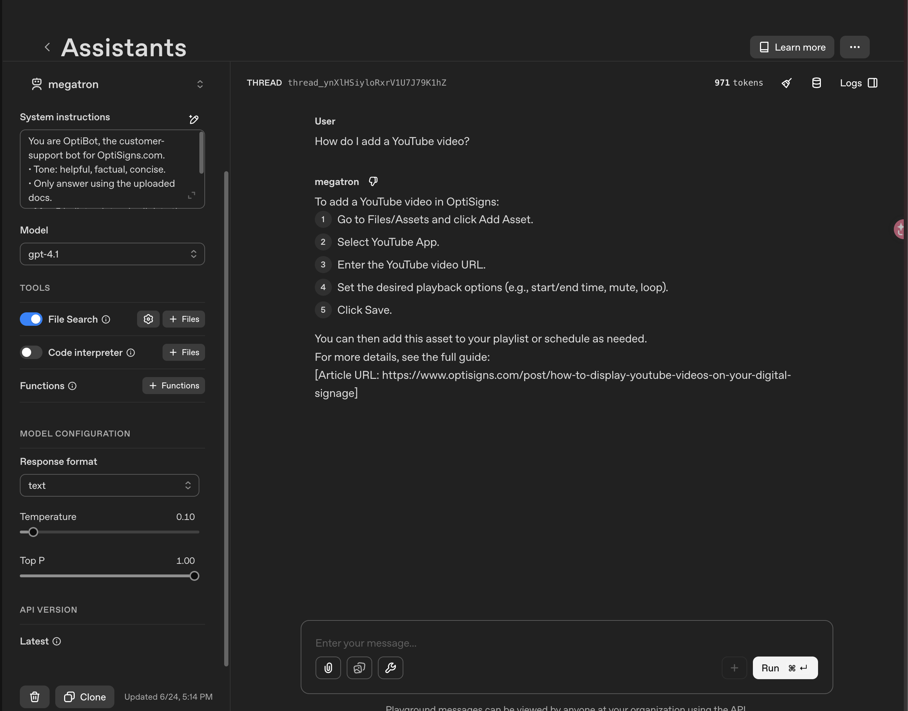

# KB Sync Bot

Daily job: scrape Zendesk help-center docs → OpenAI Vector Store (delta only) → Assistant cites sources.

**Pipeline:** Zendesk API → markdown (BeautifulSoup + markdownify) → OpenAI Vector Store (delta by SHA-256, state-of-truth = file attributes) → Playground Assistant with File Search.

## Setup

1. `pip install -r requirements.txt`
2. `cp .env.sample .env` and fill `OPENAI_API_KEY`, `VECTOR_STORE_ID`.
3. (first time only) `python scripts/bootstrap_store.py` to create the vector store; paste the ID into `.env` and into the Playground Assistant's File Search.

## Run

```bash
python main.py
# or
docker build -t kb-sync . && docker run --rm --env-file .env kb-sync
```

Exits 0 on success, non-zero on failure (so cron can mark a run failed).

**Sample log** (fresh load on the demo store):

```
INFO Scraped 401 articles
INFO Uploading 401 files with 8 workers
INFO RESULT: {'added': 401, 'updated': 0, 'skipped': 0, 'removed': 0} | chunks_embedded=1129
```

Subsequent runs are delta-only — observed `{skipped: 401}` in ~12 s.

## Scrape & clean

`src/scraper.py` calls the Zendesk Help Center list endpoint (`/api/v2/help_center/<locale>/articles.json`) once — the response already contains the article HTML body, so no per-article fetch is needed. `src/markdownifier.py` strips noise (`script`, `style`, `nav`, `header`, `footer`, `aside`) via `BeautifulSoup.decompose()`, then converts to Markdown via `markdownify` (preserves headings, code blocks, relative links). Each file is written as `articles/<slug>-<article_id>.md` with YAML front-matter + a visible `Article URL:` line so the bot can cite it.

## Assistant

Created in the Playground (gpt-4o-mini) with File Search pointed at `VECTOR_STORE_ID`. System prompt — verbatim from the spec:

```
You are OptiBot, the customer-support bot for OptiSigns.com.
• Tone: helpful, factual, concise.
• Only answer using the uploaded docs.
• Max 5 bullet points; else link to the doc.
• Cite up to 3 "Article URL:" lines per reply.
```

## Delta strategy

The vector store **is** the state store: every uploaded file carries `attributes = {article_id, hash, url}`. At the start of each run, `load_remote_state()` lists those files and rebuilds the delta map — so the container is fully stateless and the daily job stays correct across runs, even on ephemeral DigitalOcean workers.

The decision key is SHA-256 of the cleaned markdown. `edited_at` from Zendesk is unreliable as a skip filter (we observed `edited_at=2021` for articles with `updated_at=2026`), so it's stored only for reference.

## Chunking

Default OpenAI static chunking: `max_chunk_size_tokens=800`, `chunk_overlap_tokens=400`. Constants live in `src/vector_store.py` so the upload settings and the estimate stay in sync.

`chunks_embedded` is an estimate, not a queried value — `vector_stores.files.content()` returns the full file as one entry, not per-chunk. Formula: `1 + ceil((tokens - 800) / 400)` for files larger than one chunk, with `tokens ≈ chars / 4`. On the 401-article demo set this gives ~1129 chunks total (avg 2.8/file, max 83 on the largest article).

## Performance & resilience

- **Parallel uploads** — `ThreadPoolExecutor` with 8 workers (tunable via `MAX_UPLOAD_WORKERS`). Drops a fresh-load run from ~80 min to ~10 min by overlapping the per-file embedding wait.
- **Zendesk retry** — `_get_with_retry()` honors `Retry-After` on 429 and uses exponential backoff for 5xx, capped at 5 attempts. Required because Zendesk rate-limits cloud IPs aggressively (we hit this on DigitalOcean during the first deploy).
- **OpenAI 404 race** — under parallel load, the post-attach poll occasionally races with eventual consistency and returns 404 for a file that was just created. `vector_store.upload()` retries up to 3 times with backoff and deletes the orphan Files-API object before each retry to avoid leaks.

## Daily job logs

Each scheduled run pushes a public artefact (counts + timestamp) to the `logs` branch of this repo — open without login:

- **Last run**: https://github.com/DannyHo15/megatron-bot/blob/logs/runs/latest.log
- **History**: https://github.com/DannyHo15/megatron-bot/tree/logs/runs

Behind the scenes the runtime stdout is also forwarded to Better Stack (live tail). For reviewers without team access: see [`publics/do-logs.png`](./publics/do-logs.png) or `publics/betterstack-live-tail.png`. Forwarding is plumbing; the GitHub artefact above is the source of truth for reviewers.

## Sanity check

Playground question: _"How do I add a YouTube video?"_ — the Assistant replies with answer + `Article URL:` citations.



## Tests

`pytest -q` — 18 tests covering: slug stability, markdown cleaning (script/nav decompose), delta classification, chunk-count estimate, Zendesk 429/5xx retry, OpenAI 404 race retry with orphan cleanup.
